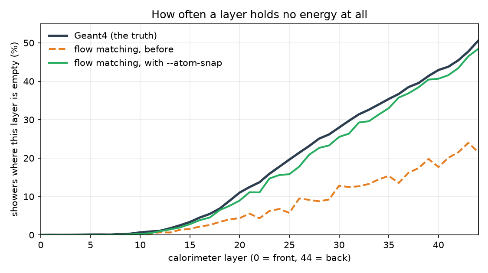

# Fast calorimeter simulation with conditional flow matching

**Google Summer of Code 2026 · ML4SCI / GENIE · PINNDE project**
Contributor: Tina · June to September 2026

Simulating particle showers in a calorimeter with Geant4 is accurate and slow,
and it uses a large share of computing in high energy physics. This project
trains a generative model to produce the same showers in milliseconds, and
builds the tools needed to check whether the result is good.

This repository is my GSoC final submission: the code, the tests, the
development log and the report.

---

## Start here

| | |
|---|---|
| **[Final report](FINAL_REPORT.md)** | What was built, what was found, what does not work yet, and how to reproduce it. Also as [Word](GSoC_2026_Final_Report_Tina.docx). |
| **[Development log](pinnde_eval/DEVLOG.md)** | The full record, 30 sections, including the measurements that contradicted things I believed earlier. |
| **[Package guide](PACKAGES.md)** | API and usage for both packages. |

## What is here

**`pinnde_eval/`** is the evaluation module, written to be used by both tracks
of the project. One call compares any two sets of showers with three tiers of
metrics: cheap monitors to run inside a training loop, the CaloChallenge's own
classifier AUC, chi-squared and separation power, and distribution distances
with error bars. It also computes the challenge's own 362 high-level features
using their code, measures what a perfect generator scores so that no number is
compared against zero, and checks whether a single generated shower is
physically possible.

**`flow_matching/`** is the generator. It learns a velocity field by regressing
onto straight-line paths from noise to data, and samples by integrating an ODE.
It is conditional on the incident particle energy, so it learns a family of
distributions rather than one. Two entry points: `demo_calo.py` generates the
362 summary features, `demo_voxels.py` generates the 6,480 raw detector cells.

**`figures/`** holds the figures used in the report. **`figure_scripts/`**
holds the scripts that produce them; each one carries the numbers it plots and
the run they came from.

**`cluster/`** has the setup scripts used to get this running on a GPU machine.

## Running it

The dataset is not in this repository (1.36 GB per file). `cluster/get_data.sh`
downloads CaloChallenge dataset 2 from
[Zenodo](https://zenodo.org/records/6366271) and verifies the checksums. Tests
that need the data skip themselves when it is absent.

```bash
pip install -r requirements.txt
OPENBLAS_NUM_THREADS=1 python -m pytest pinnde_eval/tests flow_matching/tests -q
```

171 tests pass. Then the recommended configuration, about three minutes on an
RTX 5090:

```bash
OPENBLAS_NUM_THREADS=1 python -m flow_matching.demo_calo --features official \
    --device cuda --hidden 1024 --depth 8 --steps 100000 --clip-grad 1.0 --atom-snap
```

`OPENBLAS_NUM_THREADS=1` is not optional: without it the classifier busy-waits
and a nine-second evaluation looks like a thirty-minute hang.

## The main result

A calorimeter shower does not light up every layer, and an empty layer is
recorded as an exact value. That happens in 17.8% of all layer-and-shower
pairs. A flow matching model produces a continuous density, which assigns zero
probability to any exact value, so it reproduced empty layers **0.0% of the
time**, at any model size.

Giving that point mass a band of unused values to land in during training, and
snapping it back when sampling, moved the chi-squared statistic from **50.7 to
11.7 times the Geant4 reference floor** over five random seeds, at no
computational cost. For comparison, a thirty-fold increase in model size had
previously bought 0.09 in AUC.



The whole-shower classifier did not move. [Section 6 of the
report](FINAL_REPORT.md) covers what I found when I tested my own explanation
for that, which turned out to be wrong.

## Notes

The CaloChallenge evaluation code is downloaded on demand rather than copied
into this repository, because it carries no licence.
`pinnde_eval/calochallenge.py` pins it by commit hash and checksum, and a test
checks our feature assembly against their own function to a relative tolerance
of 1e-12.
