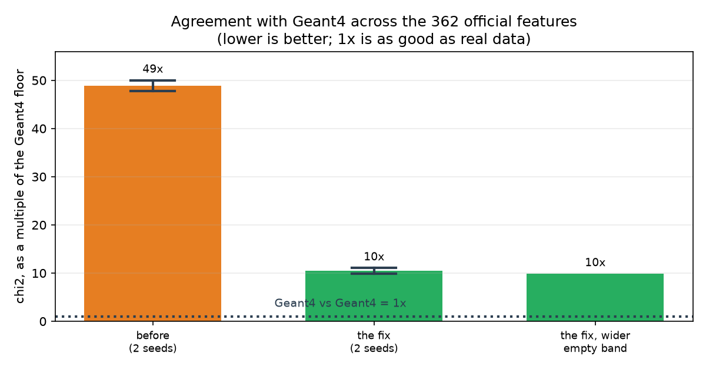

# September 18, 2026

Two things this week: the cluster GPU came online, and the model's biggest
failure in the official CaloChallenge feature space turned out to have a
specific cause.

---

## 1. GPU works

An RTX 5090 is set up and running our code. A full run is 100,000 training steps
of a 1024×8 network on 100,000 showers plus the whole scoring suite, and takes
about 3 minutes. On CPU the same run took hours.

1024×8 is the size of the network that learns the velocity field: 8 layers deep,
1024 units wide. Each of the 100,000 steps draws a batch of 256 showers and
takes one gradient step, so the model sees each training shower about 256 times.
Training uses dataset_2_1; scoring uses 8,000 showers from dataset_2_2, which
the model never sees.

Because a run is cheap, we can measure run-to-run noise instead of guessing it.
Five runs of the same configuration, differing only in the random seed, give AUC
±0.020 and chi² ±20%. Per observable family it is ±0.01 to ±0.02, except the
layer energies, which move by ±0.067. Any difference smaller than that is not a
result.

Earlier in the week this was estimated from two runs. Two runs give a range, not
a spread, and chi² turned out to vary much more than that suggested, so single
values quoted to three figures were too precise. One conclusion did not survive:
the layer-energy family had looked like it got worse with every change
(0.771 → 0.802 → 0.880), but only the last value is outside the noise band.

## 2. The problem: an empty layer is an exact value

A shower does not light up every layer. In ds2, **17.8% of all (layer, shower)
pairs are empty**, and 51% of the last layer. The official features record an
empty layer as exact numbers: log₁₀E = −8, centre and width exactly 0, sparsity
exactly 1.

What those numbers mean in energy:

| | energy | log₁₀ (MeV) |
|---|---|---|
| incident energy (the condition) | 1 GeV – 1 TeV | 3.00 – 6.00 |
| a layer that is lit at all | 15.2 keV – 61.9 GeV, median 354 MeV | −1.82 – 4.79 |
| an empty layer | exactly 0 | **−8.00** |
| nothing ever lands here | 0 – 16.2 keV | −8.00 – −1.79 |
| impossible | negative energy | below −8 |

The fourth row: a layer either gets hit, and then a particle leaves at least
15 keV behind, or nothing happens at all. Checked across all 200,000 showers in
both files, 9 million layer instances, not one deposits between zero and
15.16 keV. The floor is Geant4's production cut, so it is a property of this
dataset rather than of physics. The fix below uses that empty band.

A flow-matching model produces a continuous density, and a continuous density
puts zero probability on any exact value. Measured on 8,000 generated showers,
an exactly-empty layer appeared **0.0% of the time**.

Where that mass went instead, over all 45 × 8,000 layers:

| | exactly −8 (empty) | below −8 (impossible) | in the empty band |
|---|---|---|---|
| real Geant4 | **17.80%** | 0.00% | 0.00% |
| the model, before | **0.00%** | 7.55% | 10.95% |
| the model, with the fix | **16.44%** | 0.00% | 0.06% |

The model was not wrong about how often a layer is empty: 7.55 + 10.95 = 18.5%
of its mass sits in the no-energy region, against 17.8% in real data. It had no
way to say so, so it spread that mass across the band and put a third of it
below −8, which means less energy than nothing. The fix gives it a way to
express what it already had.

Real Geant4 puts 0.00% in the band. That is what makes snapping safe: there is
no genuine value there to destroy.


*Figure 1. Horizontal axis: the 45 layers, front (0) to back (44). Vertical
axis: the percentage of 8,000 showers in which that layer holds no energy. Dark
blue is Geant4. Orange dashed is the model before this week; it reaches only
21.6%, and that count is generous because it includes values below "empty",
which are impossible. Green is the same model with the fix.*

### The 362 features

```
  1 × log10 E_inc          the incident energy (our condition)
 45 × log10 E_layer        energy in each layer
 45 × EC_eta               centre of energy in eta, per layer
 45 × EC_phi               centre of energy in phi, per layer
 45 × width_eta            spread in eta, per layer
 45 × width_phi            spread in phi, per layer
  1 × log10 E_tot          total energy
 45 × sparsity             fraction of the layer's 144 voxels that are dark
 45 × EC_R                 radial centre of energy, per layer
 45 × width_R              radial spread, per layer
```

They are the challenge's own features, computed with their code, so our numbers
are comparable with published submissions. The real dataset is 6,480 voxels per
shower (45 layers × 16 angular × 9 radial). Challenge submissions generate
voxels and compute the features from them afterwards; we generate the 362
features directly, which is an easier problem.

## 3. The fix

If the model cannot hit an exact value, stop asking it to. Give the point mass a
region instead.

Between −8 and the smallest real non-empty energy there is a band no shower
occupies: for the last layer it runs from −8 to −1.79, about 6 log units. During
training every empty layer is spread uniformly across that band, so the model
aims at a region and only has to learn how much mass belongs there. When
generating, anything landing in the band is snapped back to exactly −8. Nothing
real lives in the band, so the snap cannot destroy a genuine value, and real
showers pushed through the round trip come back bit-for-bit identical, which is
tested.

This is the treatment already used for sparsity, which is a voxel count and
equally discrete.

That description fits the energies, where the gap is 6 log units wide. For the
134 width and radius features there is no gap: the smallest real width sits
1e-10 above zero. There the snapping does something else. It catches the model's
negative outputs, which are impossible, and maps them to exactly zero, which is
the correct value for an empty layer. One flag, two mechanisms, and the second
is why negative widths fell from 72.6% of showers to 4.8%.

### Emptiness belongs to the layer, not to the column

A column is one of the 362 numbers. Each shower is a row of 362 values; a column
is one position in that row, across all showers. Layer 44 is described by 8 of
them:

```
logE_layer_44   EC_eta_44   EC_phi_44   width_eta_44
width_phi_44    EC_R_44     width_R_44  sparsity_44
```

Per-column snapping asked each of those 8 numbers separately whether it was near
its empty value. They decided independently, so a shower could come out with
energy = empty but centre = 0.3: a layer with no energy that still has a centre
of energy. No real shower looks like that, and the classifier found it at once,
AUC 0.892 → 0.968, worse than doing nothing.

Per-layer snapping asks once whether layer 44 has energy. If not, all 8 numbers
are set to their empty values together. In real data, when a layer has no
energy, every one of its 8 columns is at its empty value 100% of the time.

The energy column decides, because it is the primary quantity: a centre of
energy only exists if there is energy. It decides both ways. A layer the energy
calls lit must have somewhere to put that energy, so sparsity 1 (every voxel
dark) is reserved for empty layers. Checking only one direction let a second
defect through: 58.6% of generated showers had a layer holding energy in zero
voxels, against 0% of real ones. With the two-way rule that is 5.9%, and it also
took sparsity-out-of-range from 44.4% to 7.0%, which had been logged as a
separate problem.



*Figure 2. Each bar is one configuration, over the 362 official features. Height
is chi² divided by the Geant4-vs-Geant4 floor, so the dotted line at 1× is
agreement as good as two independent sets of real showers. Lower is better.
Orange is the model before this week, green with the fix. The black whisker
spans two seeds, so a difference smaller than it is noise. chi² goes from 49× to
10× in these two-seed numbers; the five-seed means below are 50.7× and 11.7×.*

The two green bars:

| bar | what it is |
|---|---|
| **the fix** | `--atom-snap`: empty layers get a band during training and are snapped back when generating, one decision per layer |
| **the fix, wider empty band** | a feature counts as having an empty value if it repeats in 0.1% of showers rather than 1%. At 1% the front layers, empty in under 1% of showers, fell below the line and 8% of their widths still came out negative. Lowering it took those to 0.00% and cut impossible values across all width and radius features tenfold. Now the default |

## 4. Results

One configuration throughout, the baseline against `--atom-snap`, five seeds
each:

| | before | after | what kind of question |
|---|---|---|---|
| chi², vs Geant4 floor | 50.7 ± 3.4× | **11.7 ± 2.3×** | does each feature's distribution match? |
| separation power, vs floor | 52.8 ± 3.5× | **11.1 ± 2.3×** | the same, in the challenge's own metric |
| classifier AUC | 0.909 ± 0.017 | 0.894 ± 0.020 | can a classifier tell a whole shower apart? |
| showers with a negative width | 72.6% | **4.8%** | could this shower exist? |
| showers with an inconsistent empty layer | 49.9% | **0.03%** | could this shower exist? |
| showers with energy in zero voxels | 63.0% | **5.9%** | could this shower exist? |
| showers where E_tot ≠ sum of layers | 100% | 100% | could this shower exist? |

"×" is a multiple of what two independent sets of real Geant4 showers score
against each other, so 1× is perfect and 11.7× means we are twelve times further
from Geant4 than Geant4 is from itself. The chi² improvement is a factor of 4.3
against a combined spread of about 4 units, so it is not in doubt. The AUC
difference is inside the spread, so it counts as unchanged.

The last row needs `--derive-total`, which fixes it completely but costs chi²;
it is covered in the 21 September notes.

### Why the classifier did not move

chi² and separation power read one feature at a time. The classifier reads all
362 at once, so it can use the relationships between them, and it did not move.

The tempting explanation is that we fixed the marginals and the classifier lives
on correlations. We tested that and it is wrong. Take Geant4's exact correlation
structure and install our model's marginals into it, on the front layers where
the test is well posed. That sample is still detectable at 0.916, against 0.929
for the model itself. The marginals alone account for nearly all of the
detectability; correlations add about 0.013.

So the marginals are four times closer to Geant4 than they were and are still
what gives the model away. Not half the problem solved, but a large improvement
in the dominant defect, which remains the dominant defect.
