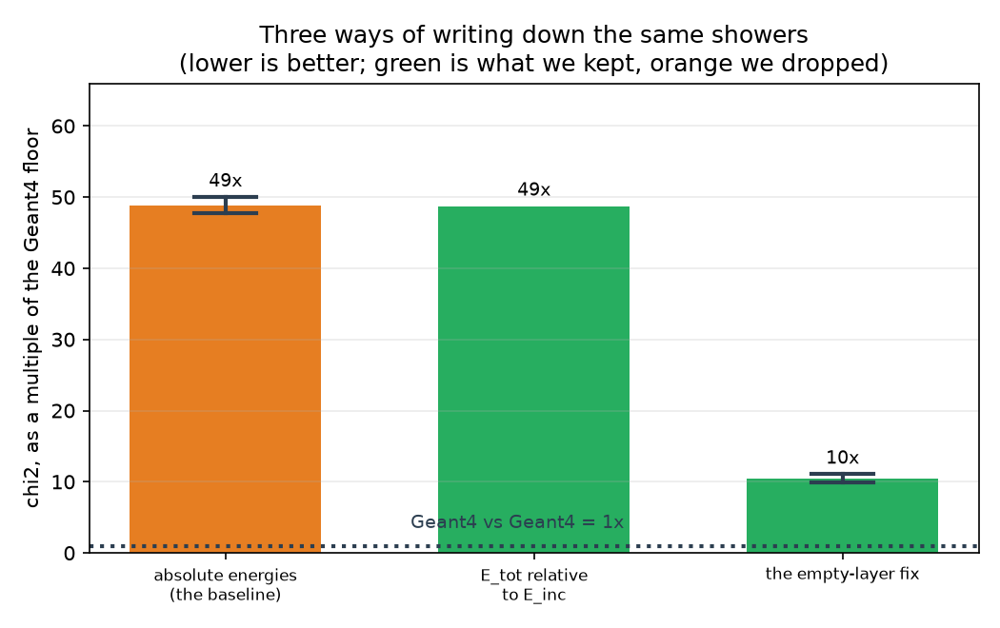
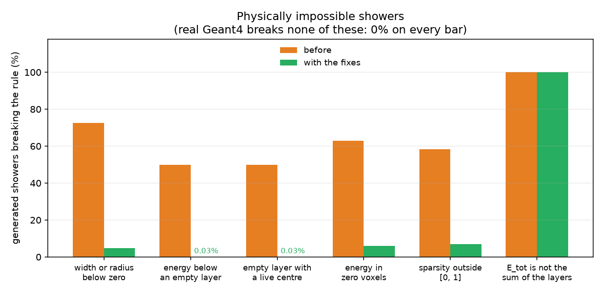

# September 21, 2026

## Recap

We train a conditional generative model
on CaloChallenge dataset 2 (calorimeter showers, 6480 voxels each, conditioned on the incident particle energy) and score it in the challenge's own 362
high-level features, against a floor measured by comparing two independent sets of real Geant4 showers = 1x.

Last Friday: 
Able to use the GPU. An
empty calorimeter layer is recorded as an exact value (log10 E = −8), that is
17.8% of all layer-shower pairs, and a continuous model produced one 0.0% of the time; giving the point mass a band to land in and snapping it back took chi² from 50.7 to 11.7 times the floor over five seeds. The classifier did not move (0.909 → 0.894), which is the open problem.

<!-- 
Figures are made by `figure_scripts/week2_summary.py`. Full record in
`pinnde_eval/DEVLOG.md` §22–30. -->

---

## 1. How the shower is written down



*Figure 1. Each bar is one way of writing the same 100,000 training showers.
Height is chi² over the 362 official features, divided by the Geant4-vs-Geant4
floor, so the dotted line at 1× is agreement as good as real data. Lower is
better.  

| written as | chi² | verdict |
|---|---|---|
| absolute energies | 49× | the baseline |
| **E_tot relative to E_inc** | 49× | **kept**, no chi² gain but it fixes the energy response |
| **the empty-layer fix** | **10×** | **kept** |


**E_tot relative to E_inc is kept for something chi² does not report.** It
models total energy as a fraction of the incident energy instead of an absolute
number. Pooled chi² does not move. The sampling fraction, how much of the
incident energy the calorimeter records, goes from detectably wrong to
indistinguishable from Geant4: that family scores 0.502 against a measured floor
of 0.488, having been 0.697. The sampling fraction matters for calorimeter
physics, so we take it even though the summary number is flat. 

### Why writing it differently changes the score

The score is always measured in the same place. Whatever space the model works
in, we convert its output back to the official 362 features and compare
histograms there. So how we write the data does not change the measurement. It
changes what the model can produce. 

**Some values cannot be produced at all.** An empty layer is exactly −8. A
continuous model never lands on an exact number, so it produced −8 in 0.0% of
cases, where real data has 17.8%. chi² compares histograms, so a missing spike
that size is a large difference in every layer. Making that value reachable took
chi² from 50.7 to 11.7 times the floor.

**A small error can become a large one when we convert back.** One version we
dropped modelled the square root of the energy. There the model produced 0.00003
where real showers have 0.0154, which looks like a tiny error. Converted back to
log energy it is −0.4, where the truth is −8. The model was not much less
accurate; the conversion turned a small error into a big one.

Model size does neither of these. Going from a 384×5 network to 1024×8 cost 30
times the compute and gained 0.09 in AUC. Changing how empty layers are written
cost nothing and moved chi² by a factor of 4.3.

## 2. Physical check: could this shower exist?

Every metric in the project compares *distributions*. chi², separation power
and the classifier all take two piles of showers and ask whether the piles look
alike. None of them ever looks at a single shower and asks whether it is
physically possible.

Real Geant4 showers run through the test and passed with 0% = all real. 



*Figure 2. One group per physical rule. Bar height is the percentage of 8,000
generated showers breaking that rule, so lower is better and 0% is correct.
Orange is the baseline, light blue the empty-layer fix, green that plus
computing E_tot from the layers. Real Geant4 has no bars because it breaks none
of these.*

**The first finding: total energy.** Every generated shower had a total energy
that is not the sum of its 45 layer energies. 
Nothing in the model tied them together, and no distribution metric noticed,
because each of the 46 numbers looked reasonable on its own.

`--derive-total` fixes it by construction: stop modelling total energy, add up
the 45 generated layer energies. 100% → 0%. It does **not** improve any
distribution metric. Its two seeds sit at chi² 9.9 and 14.5, which, now that we
have measured the spread properly (±20% over five seeds), is ordinary seed
scatter rather than the instability it looked like. We keep it because it is
correct, not because it scores better.

**The second: How we decide a
layer is empty when eight numbers describe it?** the answer is that the energy
decides. That exposed a gap: the rule only ran one way. A layer the energy
called *lit* could still come out with sparsity 1, meaning every one of its 144
voxels is dark. That is energy sitting in no voxel at all. **63% of baseline showers
had at least one such layer**, and the empty-layer fix barely touched it (58.6%),
because it was never looking in that direction.

e.g. 
logE_layer_30 = −8 means no energy in layer 30,
sparsity_30 = 1 means all 144 of its voxels are dark

The rule is now symmetric: the energy decides both ways, and sparsity 1 is
reserved for layers that really are empty. Measured over five fresh runs, it
fixes more than it was aimed at:

| check | before | with the symmetric rule |
|---|---|---|
| lit layer has a lit voxel | 58.6% | **5.9%** |
| sparsity outside [0, 1] | 44.4% | **7.0%** |

The second row was not the target. Sparsity above 1 means a negative number of
lit voxels, and it had been on the list as a separate problem needing its own
bounded representation, but most of it was the same defect seen from another
angle, and capping a lit layer's sparsity at "one lit voxel" removed six sevenths
of it for free.

## 3. What this says about our metrics

### How a model is actually checked

1. Train on 100,000 showers from file 1.
2. Generate 8,000 showers. Each one is generated at the incident energy of a
   real shower in file 2, which the model never sees during training.
3. Convert the generated output back to the official 362 features.
4. Compare the two sets of 8,000, three ways: each feature on its own (chi² and
   separation power), all 362 at once (train a classifier, report its AUC), and
   each shower on its own (the physical checks).
5. Compare every number to the floor, and also split it by energy quartile and
   by feature family, because a pooled number hides a bad slice.

The floor is the same measurement run on two sets of **real** Geant4 showers,
matched shower by shower in incident energy. It is not zero: 8,000 showers carry
sampling noise, so real against real gives chi² 0.95 and AUC 0.5003. That is
what a perfect generator scores, and it is what "1×" means everywhere here.

The energy matching matters. Our model generates at the evaluation set's own
energies, so it never pays the cost of drawing energies independently. Against a
floor measured without that matching, a model once looked better than Geant4.

We also check the checker. Replacing the model with real Geant4 showers, and
running them through the identical path, must land on the floor. It did not at
first, and that found three bugs: a transform that moved exact zeros by 7e-18,
a range test that flagged 59% of real values as impossible, and a quantizer one
bit off the stored value, which made a statistical test reject a **perfect**
generator at p = 5e-25.

### Three kinds of question

They do not substitute for each other:

| | asks | blind to |
|---|---|---|
| chi², separation power | is each feature's distribution right? | how features relate within one shower |
| classifier AUC | can a classifier tell a whole shower apart? | nothing, but it only gives one number and does not say what is wrong |
| physical checks | could this shower exist? | whether the distribution is right at all |

The energy-in-zero-voxels defect shows what chi² cannot see. The energy
feature's distribution is fine on its own, and so is sparsity's. chi² inspects
them one at a time and reports nothing. A classifier sees both numbers of the
same layer together and finds the impossibility immediately.

It is tempting to conclude that this is why chi² improved fourfold while the
classifier did not move. We tested that and it is not the explanation. A sample
carrying our marginals with Geant4's exact correlations is still detectable at
0.916, against 0.929 for the model, so the marginals account for nearly all of
it. The correlation defects are real but they are not the binding constraint.

## 4. Generating the shower itself: first attempt

We never generated a shower directly, it uses
quantities derived from one, so the reason to generate showers accurately is
that a generator which gets the voxels right is then known to be right for
everything downstream. Now, `flow_matching/demo_voxels.py` generates
the **6480 voxel energies** and then computes the 362 features from them with
the challenge's own code, so the numbers land in the same space against the same
floors.

**It does not work yet.** The reasons are specific.

```
  run                        auc   chi2/floor   median E_tot/E_inc
  100k showers, 100k steps  1.000       124x            990,000x
  narrower empty band       1.000       136x                184x
  real Geant4                0.50         1x               0.78x
```

Five times the data and five times the training changed nothing (123.9x to
124.4x), so this is not undertraining. 3 potential causes:

1. **The informative values sit in the tail.** 75% of voxels are empty, so a
   voxel's average is near "empty" and the real lit energies end up about three
   standard deviations out. That is where a flow is least accurate, and where
   being off by one unit of z means being off by a factor of 300 in energy.
2. **Most of what we ask the network to predict is noise we added.** Spreading
   the empty mass over the full 6-log-unit gap accounts for up to 51% of a
   sparse voxel's variance, against a real signal of about 11%. Narrowing that
   band improves the energy scale by a factor of 5400.
3. **Log space has no ceiling, and that dominates.** 22.4% of generated layers
   hold more energy than any layer in real ds2, and those layers carry
   essentially 100% of the model's total energy. Drop them and the totals land
   within a factor of 7 of reality instead of 184.

The bulk of the distribution is not far off -- the median generated layer holds
445 MeV against Geant4's 354 -- but the model lights 2.5x too many voxels and
the tail is unbounded.

## Wrapping up

- Everything is committed and pushed: 31 modules, 171 tests, two evaluation
  packages, the write-ups and the figures that produce them.
- `FINAL_REPORT.md`: 
  what does not work, and how to reproduce it. 